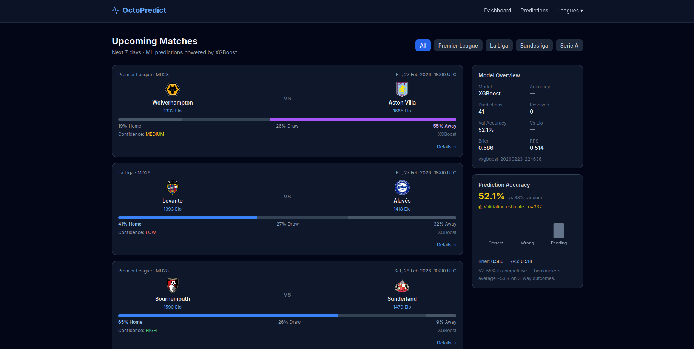

# OctoPredict


A production-ready football match prediction platform powered by XGBoost and dynamic Elo ratings.

## Features

| Feature | Description |
|---------|-------------|
| **3-way predictions** | Home Win / Draw / Away Win with calibrated probabilities |
| **22 ML features** | Elo ratings, form, H2H, league position, rest days |
| **XGBoost + calibration** | Isotonic calibration for reliable probability estimates |
| **Dynamic Elo ratings** | Recomputed from all historical results, K=32, +100 home advantage |
| **4 leagues** | Premier League, La Liga, Bundesliga, Serie A |
| **Live data** | Auto-refreshed twice daily from football-data.org |
| **Evaluation metrics** | Brier score, RPS (Ranked Probability Score), accuracy timeline |
| **Full dashboard** | Next.js 14 frontend with real-time updates |
| **REST API** | FastAPI + auto-generated OpenAPI/Swagger docs |
| **One-command start** | `docker compose up --build` |

## Quick Start

### 1. Get a free API key

Register at [football-data.org](https://www.football-data.org/client/register) (takes ~1 minute).

### 2. Configure environment

```bash
cp .env.example .env
# Edit .env and set your FOOTBALL_DATA_API_KEY
```

### 3. Launch

```bash
docker compose up --build
```

On first boot (~2–5 minutes):
1. Database migrations run automatically
2. 3 seasons of historical data fetched (rate-limited to 10 req/min)
3. Elo ratings computed from all historical matches
4. XGBoost model trained (falls back to Elo predictor if < 50 samples)
5. Predictions generated for upcoming fixtures

### 4. Open

- **Frontend**: http://localhost:3000
- **API docs**: http://localhost:8000/docs

## Development

### Backend

```bash
cd backend
pip install -e .
cp ../.env.example ../.env  # edit with your API key
uvicorn app.main:app --reload
```

### Frontend

```bash
cd frontend
npm install
npm run dev
```

## Architecture

```
┌──────────────┐    ┌──────────────────┐    ┌─────────────────┐
│  Next.js 14  │───▶│   FastAPI/Python  │───▶│  SQLite + WAL   │
│  Port 3000   │    │   Port 8000       │    │  (async aiosqlite)│
└──────────────┘    └──────────────────┘    └─────────────────┘
                           │
              ┌────────────┼────────────┐
              ▼            ▼            ▼
       XGBoost ML    football-data   APScheduler
       + Elo Elo      .org API      (4 background
       predictor    (rate-limited)    jobs)
```

## API Endpoints

| Method | Endpoint | Description |
|--------|----------|-------------|
| GET | `/api/v1/health` | Health check |
| GET | `/api/v1/leagues` | List tracked leagues |
| GET | `/api/v1/leagues/{code}/standings` | Live standings |
| GET | `/api/v1/matches/upcoming` | Upcoming fixtures + predictions |
| GET | `/api/v1/matches/recent` | Recent results |
| GET | `/api/v1/matches/{id}/features` | Feature transparency |
| GET | `/api/v1/predictions/history` | Paginated prediction history |
| GET | `/api/v1/predictions/accuracy` | Accuracy stats |
| POST | `/api/v1/predictions/generate` | Trigger prediction generation |
| GET | `/api/v1/teams` | List teams |
| GET | `/api/v1/teams/{id}` | Team detail + Elo history |
| GET | `/api/v1/stats/model` | Model version + feature importances |
| GET | `/api/v1/stats/overview` | Dashboard summary |
| POST | `/api/v1/admin/sync` | Manual data refresh |

## ML Details

### Features (22 total)
1. **Elo** (3): `elo_home`, `elo_away`, `elo_diff`
2. **Form last 5** (8): pts, GF, GA, wins for home/away team
3. **Head-to-head** (3): H2H wins/draws in last 5 meetings
4. **League position** (4): position, position diff, points diff
5. **Context** (4): rest days, home/away-specific form

### Cold Start Fallback
When < 50 training samples are available, `EloOnlyPredictor` converts Elo ratings into 3-way probabilities using the logistic formula. The response includes `model_type: "elo_fallback"`.

### Evaluation
- **Brier Score**: lower is better (0 = perfect, 1 = worst)
- **RPS (Ranked Probability Score)**: proper scoring rule for ordered outcomes

## Background Jobs

| Job | Schedule | Action |
|-----|----------|--------|
| `sync_fixtures` | 06:00, 18:00 UTC | Fetch upcoming fixtures |
| `sync_results` | Every 2 hours | Update scores, resolve predictions |
| `retrain_model` | Monday 03:00 UTC | Weekly retraining |
| `generate_predictions` | 07:00 UTC daily | Predict new fixtures |

## License

MIT
